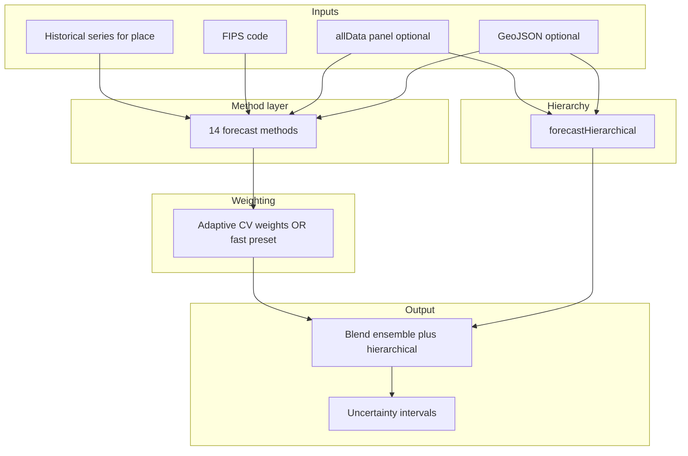

# How the SAHIE prediction model works

This document describes the **enhanced ensemble** used in this application: data sources, every forecasting method, how weights are chosen, how the result is blended with a hierarchical forecast, uncertainty bands, and county-specific tuning.

The implementation lives mainly in:

- [`js/forecasting-models.js`](../js/forecasting-models.js) — baseline time-series methods and `forecastXGBoostGlobal`
- [`js/enhanced-forecasting-models.js`](../js/enhanced-forecasting-models.js) — ensemble, adaptive weights, spatial/hierarchical layers, backtests
- [`js/xgboost-features.js`](../js/xgboost-features.js), [`js/xgboost-scorer.js`](../js/xgboost-scorer.js), [`js/xgboost-model-data.js`](../js/xgboost-model-data.js) — global pooled tree model (method name `xgboostGlobal`)

---

## 1. What is being predicted?

- **Variable:** Estimated **health insurance coverage** as a **percentage of the population** (0–100%), from the U.S. Census Bureau **SAHIE** (Small Area Health Insurance Estimates) time series.
- **Geography:** A **state** (2-digit FIPS) or **county** (5-digit FIPS).
- **History:** Annual points from **2006–2022** (API-driven; the UI may reference later years for “forecast from” context).
- **Panel for context:** For counties, the model can use **`allData`** — a map `{ fips: [{ year, value }, ...] }` for many places — loaded via `ForecastingModels.fetchAllHistoricalData(...)` so spatial and state-average features use the same vintage of data as the selected demographics.

---

## 2. Anchor year and horizons

`ForecastingModels.resolveAnchorYear(historicalData, anchorYearOverride)` defines:

- **`lastHistoricalYear`** — last year in the input series.
- **`anchorYear`** — usually `max(lastHistoricalYear, current calendar year)` for live forecasts, or an explicit override (e.g. backtests fix the anchor at the end of a training window).

Forecasts are produced for **`yearsAhead`** steps: future years `anchorYear + 1, anchorYear + 2, ...` up to the requested horizon.

If there is a **gap** between `lastHistoricalYear` and `anchorYear` (e.g. forecasting “as of” a later calendar year than the data), the enhanced model can insert **interpolated gap-year** points between history and the first true model year.

---

## 3. End-to-end pipeline

At a high level:

1. **Spatial cache:** `initializeSpatialRelationships(fips, allData)` builds neighbor lists (same-state counties for a county; other states for a state) and rough state/national context used by spatiotemporal features.
2. **Methods:** Each method returns a **vector of future years** with `predicted` (and often extra fields).
3. **Weights:** Either **`calculateAdaptiveWeights`** (default UI path) or **`getPresetFastBatchWeights`** when `options.fastBatch` is true (internal batch runs).
4. **Per-horizon blend:** For each future step `i`, a **weighted average** of all methods that have a prediction at that index yields **`ensembleValue`**.
5. **Hierarchical blend:** `forecastHierarchical` produces a path that respects **state** (and a simplified **national**) structure; that path is mixed with **`ensembleValue`** using a **county vs state** weight `hierW`.
6. **Uncertainty:** `calculateUncertaintyIntervals` adds **lower/upper** bands around the blended point forecast using historical volatility.

---

## 4. The fourteen ensemble methods

Each method is keyed by the same name used in `CV_METHOD_NAMES` in [`enhanced-forecasting-models.js`](../js/enhanced-forecasting-models.js). Below, “**one-step**” in cross-validation means: train only on years **before** the next calendar year, predict that next year, compare to the actual — repeated in an expanding window (see section 5).

| Key | Description |
|-----|-------------|
| **naive** | Repeat the **last observed** coverage for every future year. Strong baseline. |
| **linear5Year** | **Ordinary least squares line** fit to the **last five** years only; extrapolated forward. |
| **holts** | **Holt’s linear trend** (double exponential smoothing): level + trend with data-driven smoothing parameters (`selectHoltsParams`). |
| **dampedHolts** | Holt-style with a **damped trend** (trend shrinks toward zero at longer horizons via a damping factor, default 0.9). |
| **arima** | A **simplified ARIMA(1,1,1)-style** update on **first differences** of the series, with hand-fit AR/MA coefficients on differences (not full statsmodels). |
| **quadratic** | **Polynomial regression** (degree 2) on year vs value; extrapolated. |
| **cagr** | **Compound annual growth** from first to last historical point; projects level forward with constant growth. |
| **theta** | **Theta-method style:** linear trend on levels, **simple exponential smoothing** on residuals, combined with a local last-value extrapolation; picks smoothing `alpha` from a small grid. |
| **weightedLinear** | **Weighted least squares** line on **all** years with **exponential weights** favoring recent observations (and extra weight on the last five years). |
| **ar** | **Autoregressive** model: order chosen by **BIC** among orders 1–4; coefficients by least squares on lags. |
| **spatiotemporal** | Starts from a **5-year linear** forecast, then adjusts using **same-state “neighbors”** in `allData` and caps deviation from **state average** (see `COUNTY_TUNING` for county-specific pull/cap). |
| **multivariate** | Primarily a **time trend** fit on recent years; can incorporate **exogenous** placeholders (e.g. PLACES store) when present — often falls back to linear behavior. |
| **yoyChange** | Models **year-over-year changes**, averages recent changes, projects forward with **decay** so large swings do not persist forever. |
| **xgboostGlobal** | **Global pooled gradient-boosted regression trees** trained **offline** (see [`scripts/train-xgboost-model.mjs`](../scripts/train-xgboost-model.mjs)): many counties × many cutoff years. At runtime, **no Python/XGBoost library** — the browser loads a **JSON model** and [`xgboost-scorer.js`](../js/xgboost-scorer.js) walks the trees. Features (10-D) are built in [`xgboost-features.js`](../js/xgboost-features.js): last value; three lagged **year-over-year deltas**; mean, std, slope over up to the last **5** points; **state average** coverage at the anchor year (from other counties in the same state); **difference from state**; **series length**. Multi-year forecasts **chain** one-year predictions (append predicted point, recompute features). The method name is **xgboostGlobal** for historical reasons; the shipped artifact is a **gradient-boosted CART ensemble** (`ml-cart` in Node), exported as JSON for the browser. |

---

## 5. Adaptive weights (cross-validation)

**`computeMethodCvMse(...)`** for each method:

- Sorts history by year.
- Uses **minimum training length** 5; for each `end` from 5 to `length - 1`, builds `train = sorted.slice(0, end)` and checks **one-year-ahead** prediction (`actual` must be exactly `lastTrainYear + 1`).
- Uses **`filterAllDataToEndYear(allData, anchor)`** so the panel **does not leak future years** when spatial/multivariate methods need `allData`.
- Accumulates **mean squared error** of one-step ahead predictions; returns **MSE** or a large penalty if no valid folds.

**`calculateAdaptiveWeights`** then:

1. Computes **MSE** for **every** method in `CV_METHOD_NAMES`.
2. Finds **best** MSE; **trims** methods worse than **3× best** (their effective MSE is capped for weighting).
3. Sets raw weight **∝ 1 / (effectiveMSE + ε)** with **ε = 0.08**, then **normalizes**.
4. Applies a **floor of 2%** per method so nothing is dropped entirely, then renormalizes.

**Small-region adjustment** (short history or few neighbors): boosts **naive**, **linear5Year**, **cagr**; slightly reduces **arima**; renormalizes.

**County adjustment** (`COUNTY_TUNING`): multiplies weights for **naive**, **weightedLinear**, **theta**; dampens **dampedHolts**; renormalizes.

---

## 6. Fast batch mode (`fastBatch`)

When `forecastEnhancedEnsemble(..., { fastBatch: true })` (used by internal county batch tools):

- **Weights** come from **`getPresetFastBatchWeights`** instead of full CV (saves a lot of computation).
- **spatiotemporal** and **multivariate** are replaced by **plain 5-year linear** forecasts (same shape, lighter).
- **`forecastHierarchical`** uses **linear** bases instead of full spatiotemporal for county/state paths.

The **interactive predictive panel** does **not** set `fastBatch` by default, so users get **full adaptive weights** and full spatial/multivariate/hierarchical components.

---

## 7. Hierarchical forecast and blend

**`forecastHierarchical`** (simplified description):

- Builds a **base** county trajectory (spatiotemporal, or linear in `fastBatch`).
- If a **state** series exists in `allData`, fits a **state-level** forecast and **softly constrains** the county path toward it (caps on deviation, small blend).
- Builds a **national** aggregate from state series where possible and applies **similar** soft constraints.
- **Output:** a `forecast` array aligned with the horizon.

**Final blend per horizon:**

- `ensembleValue` = weighted sum of method predictions **÷** sum of weights of methods that had a value at that step.
- `hierPred` = hierarchical forecast at the same index.
- **County:** `blended = (1 - hierW) * ensembleValue + hierW * hierPred` with **`hierW` from `COUNTY_TUNING.hierBlendWeight`** (default **0.2**).
- **State:** `hierW = 0.14`.
- Result is **clamped** to [0, 100].

---

## 8. Uncertainty intervals

**`calculateUncertaintyIntervals`** uses historical **year-over-year** variability and residual-style spread to set a **scale** per horizon, then applies a **calibration** factor. For **counties**, **`COUNTY_TUNING.uncertaintyCalibration`** can override the default **1.42** (slightly **tighter** bands for counties).

---

## 9. Backtesting (validation)

**`backtestForecast`** rolls the clock: for each valid training window and horizons **1, 3, and 5** years, it calls **`forecastEnhancedEnsemble`** with **no future leakage** in `allData`, compares predictions to realized SAHIE, and aggregates **MAE, RMSE, MAPE**, naive skill, directional accuracy, interval coverage, etc.

**`backtestMcmcForecast`** uses the **same** rolling windows and horizons but scores a separate **Bayesian time-series** model (see below). The predictive panel runs both backtests in parallel and shows a **side-by-side comparison** (metrics, per-horizon error, and two scatter charts).

---

## 10. Bayesian AR(1) with trend via MCMC (comparison model)

This is **not** part of the 14-method ensemble. It is a **standalone comparator** implemented in [`js/mcmc-forecasting.js`](../js/mcmc-forecasting.js) and invoked from [`js/enhanced-forecasting-models.js`](../js/enhanced-forecasting-models.js) as **`backtestMcmcForecast`**.

### Model

- Observed coverage \(y_t\) (annual, sorted by calendar year).
- **Linear trend in time** (time origin = first year in the training window):  
  \(\mu_t = \alpha + \beta (t - t_0)\).
- **AR(1) residual** around that trend:  
  \(r_t = y_t - \mu_t\), with \(r_t = \phi r_{t-1} + \varepsilon_t\).  
  By default, \(\varepsilon_t\) is **Student-\(t\)** with \(\nu=5\) (heavier tails than Gaussian, to absorb occasional SAHIE shocks). Set `studentT: false` in `mcmcOptions` for Gaussian innovations.
- When \(|\phi|\) is below a stability cutoff, the **first** residual \(r_0\) uses the **stationary Gaussian** marginal \(r_0 \sim \mathcal{N}(0, \sigma^2/(1-\phi^2))\); otherwise the likelihood uses only \(t = 2\ldots T\) (conditional AR).

### Priors (weakly informative)

- \(\alpha \sim \mathcal{N}(75, 20^2)\) (percent insured is usually on a plausible scale).
- \(\beta \sim \mathcal{N}(0, 2^2)\) (drift in **percentage points per year** kept moderate a priori).
- \(\phi\) **uniform** on \((-a,a)\) with \(a \approx 0.989\), implemented via \(\phi = a\tanh(\eta_\phi)\) so proposals never hit a hard boundary.
- \(\sigma \sim \mathrm{HalfNormal}(5)\) with **log-\(\sigma\)** proposals (always positive).
- The innovation density uses \(\sigma_\mathrm{lik}=\max(\sigma, 10^{-3})\) so near-perfect fits do not yield infinite log-likelihoods.

### Metropolis–Hastings

- **Scalar random-walk** updates on \((\alpha, \beta, \eta_\phi, \log\sigma)\) each iteration, with **adaptive** step scales during burn-in (target acceptance ~0.23–0.44).
- Default: **8000** iterations, **2000** burn-in, **thin by 5** → **1200** retained draws.
- **Seed** is fixed per backtest fold (from FIPS + training end year + horizon) so results are **reproducible**.
- **Warm start**: OLS trend + **OLS \(\phi\)** on detrended residuals, then \(\sigma\) from AR residuals.

### Forecast and uncertainty

- For each posterior draw, the **last** trend residual \(r_T\) is recomputed from the training window and that draw’s \((\alpha,\beta)\).
- For horizon \(h\): simulate \(h\) AR(1) shocks forward (**Student-\(t\)** if `studentT` is on, else Gaussian), add the trend level at year \(t_0 + h\), **clamp** to \([0,100]\).
- **Point forecast**: median over posterior draws at each horizon.
- **95% band**: 2.5% and 97.5% quantiles of the simulated predictive distribution (per horizon).

### Reading the comparison panel

- **MAE / RMSE / MAPE**: same definitions as the ensemble backtest; **lower** is better.
- **Interval coverage**: fraction of backtest folds where the **real** value fell inside the model’s band. For the MCMC model, **95%** predictive bands are **well calibrated** only if the structural assumptions (smooth trend + AR(1) shocks) roughly match the data; coverage **near 95%** suggests the uncertainty is honest, while **very low** coverage means the process is harder than this model assumes.
- **When the ensemble tends to win**: short horizons, counties with **spatial/context** signal the trees and spatiotemporal layers exploit, or **structural breaks** where a **pooled** or **multi-method** blend adapts better than a single smooth AR process.
- **When MCMC is competitive or wins on error**: **smoother** county series where AR(1)+trend is a good approximation; **intervals** are a first-class output for MCMC, while ensemble intervals use a separate heuristic.

---

## 11. Retraining the global tree model (`xgboostGlobal`)

1. Install dependencies: `npm install`
2. Run: `npm run train-xgboost`
3. This regenerates **`js/xgboost-model.json`** and **`js/xgboost-model-data.js`** (which sets `window.XGBLOBAL_MODEL_JSON`).

The app loads **features → model data → scorer** before **`forecasting-models.js`** in [`index.html`](../index.html). If the model file is missing or fails to load, **`xgboostGlobal`** returns an empty forecast and contributes nothing to the ensemble.

---

## 12. Summary table

| Stage | Role |
|-------|------|
| 14 methods | Diverse statistical and ML-style views of the same history (+ spatial / global context). |
| CV weights | Data-driven: **trust** methods that **one-step-ahead** historically fit this series (with floors and county tweaks). |
| Hierarchical blend | Pulls the **ensemble** toward **state/national** consistency so single counties do not drift unrealistically. |
| Intervals | Uncertainty from historical volatility + calibration. |
| `xgboostGlobal` | **Cross-county** learned patterns from offline training, blended like any other method. |

This design keeps the **interpretable** structure (many explicit methods + weights) while allowing **machine-learned** pooled signal where it helps.
